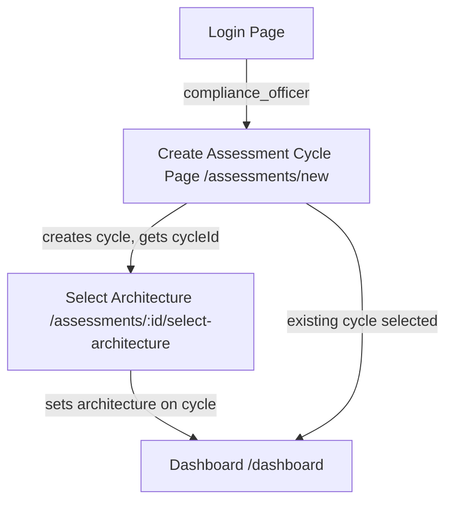
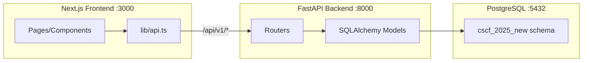

# Full Stack Backend + Frontend Integration

## Current State

- **Frontend:** Next.js 16 app at `frontend/` with mock auth (localStorage-based `AuthContext`), static data in `lib/data/*.ts`, 8 domain pages, role-based routing
- **Backend:** None -- no Python, no API, no database
- **Data Sources:** `SWIFT_Compliance_Platform_PRD_v2.docx` (authoritative schema -- 20 tables, 21 ENUMs), `SWIFT_CSCF_v2025_Canonical_Evidence_Model.xlsx` (53 evidence items, control mappings, sufficiency matrix), `MultiControl_Evidence_Sufficiency.xlsx` (multi-control items, sufficiency detail)
- **DB credentials:** `127.0.0.1:5432`, database `compliance`, user `postgres`, app user `compliance-audit`, password `Compliance_Audit01`, SSL off

---

## New Compliance Officer Flow (Key Change)

The current flow is: Login -> Select Architecture -> Dashboard. The new flow adds a **"Create Assessment Cycle"** step. A compliance officer can create **multiple assessment cycles** (different years/versions). Only after creating one do they pick its architecture.




- `**/assessments/new**` -- New page. Lists existing cycles for this tenant (cards: label, year, phase, architecture). Has a "Create New Cycle" form (label, year, target date). Clicking an existing cycle enters it. Clicking "Create" calls `POST /api/v1/assessments`.
- `**/assessments/:id/select-architecture**` -- Existing architecture selection page, but now scoped to a specific cycle ID. On select, calls `PUT /api/v1/assessments/:id` to set the architecture and advance phase from `setup` to `collection`. Then redirects to `/dashboard`.
- A cycle in `setup` phase (no architecture yet) forces the user to pick architecture first.
- A cycle already in `collection` or later phase goes straight to dashboard.

---

## Zero-State Principle (Key Change)

Once the backend is connected, **all dynamic data starts at 0**:

- Dashboard domain cards: 0/N items completed, 0% progress
- Control heatmap: all scores 0, all statuses "not_started"
- Evidence model: 0 submissions, all items show "Not started"
- Review queue: empty
- Approval page: all gates "pending", score 0%
- Report page: no sections generated

The frontend static mock data in `lib/data/*.ts` (which has pre-filled scores like `score: 95`, `completed: 5`) will be replaced by real API responses. Reference data (domains, controls, evidence item definitions) comes from the database; all mutable state (scores, submissions, reviews) comes from the assessment cycle and starts empty.

---

## Phase 1: Raw SQL -- Schema + Tables + Seed Data

### 1a. Schema DDL: [backend/sql/01_schema_ddl.sql](backend/sql/01_schema_ddl.sql)

A single SQL file run directly with `psql` that does everything:

```sql
-- Run as: psql -U postgres -d compliance -f backend/sql/01_schema_ddl.sql
```

Contents:

1. `CREATE SCHEMA IF NOT EXISTS cscf_2025_new;`
2. `SET search_path TO cscf_2025_new;`
3. `CREATE EXTENSION IF NOT EXISTS "uuid-ossp";`
4. Create **21 ENUM types** (all under `cscf_2025_new` schema):
  - `architecture_type` (A1, A2, A3, A4, B)
  - `user_role` (admin, compliance_officer, it_sme, internal_reviewer, external_assessor, approver)
  - `assessment_phase` (setup, collection, review, approval, reporting, submitted, archived)
  - `control_type` (mandatory, advisory)
  - `collection_priority` (critical, high, medium)
  - `reuse_tier` (foundational, ultra_high, high, moderate, control_specific)
  - `collection_model` (standard, per_system, per_vendor, per_quarter)
  - `evidence_status` (draft, submitted, in_review, returned, approved, escalated)
  - `review_level` (l1_completeness, l2_quality, l3_assessment)
  - `review_status` (assigned, in_progress, approved, returned, escalated)
  - `review_decision` (approve, return, escalate)
  - `gate_type` (evidence_complete, internal_review, assessment_complete, final_attestation)
  - `gate_status` (pending, approved, blocked)
  - `sufficiency_status` (not_started, insufficient, partial, sufficient)
  - `evaluation_source` (system, ai, human)
  - `upload_status` (uploading, uploaded, processing, processed, failed)
  - `report_type` (draft, final)
  - `compliance_status` (compliant, non_compliant, partial)
  - `vendor_classification` (outsourcing_agent, connectivity_provider, it_provider, cloud_provider, software_vendor, consulting_firm)
  - `vendor_access` (remote, on_site, both, none)
  - `subscription_tier` (trial, professional, enterprise)
5. Create **20 tables** (each includes `cscf_version VARCHAR(10) NOT NULL DEFAULT '2025v'`):
  - `tenants` -- BIC code, architecture_type, subscription_tier, settings JSONB
  - `users` -- password_hash (Phase 1 local auth), per-tenant unique email, mfa_enabled
  - `audit_frameworks` -- immutable framework definitions, metadata JSONB
  - `controls` -- 32 CSCF controls, architecture_applicability TEXT[]
  - `evidence_domains` -- 8 domains A-H, color codes, item counts
  - `canonical_evidence_items` -- 53 items, JSONB input_schema + sufficiency_dimensions, collection_model, reuse_tier
  - `item_control_mappings` -- M:N junction, is_primary, weight, sufficiency_requirement
  - `cross_domain_dependencies` -- cross-domain validation rules
  - `assessment_cycles` -- 7-phase lifecycle, framework_id FK, snapshot_data, previous_cycle_id self-ref
  - `control_applicability` -- per-cycle scoping, override support
  - `evidence_submissions` -- scope_key pattern, form_data JSONB, AI fields
  - `evidence_attachments` -- file metadata, SHA-256, upload_status
  - `vendor_registry` -- domain F vendors per cycle
  - `sufficiency_scores` -- per-control per-cycle aggregate
  - `sufficiency_evaluations` -- append-only per-item evaluation log
  - `review_assignments` -- 3-level workflow with SLA tracking
  - `review_comments` -- threaded, mentions UUID[], resolution tracking
  - `approval_gates` -- 4 sequential gates, MFA for final
  - `assessment_reports` -- JSONB sections, snapshot_data, draft/final
  - `audit_log` -- BIGSERIAL PK, partitioned by month (12 partitions), immutability trigger
6. All indexes per PRD
7. Immutability trigger on `audit_log` (prevent UPDATE/DELETE)
8. RLS policies on 13 tenant-scoped tables

### 1b. Reference Data Seed: [backend/sql/02_seed_reference_data.sql](backend/sql/02_seed_reference_data.sql)

Static SQL INSERT statements for the 6 immutable reference tables. All rows have `cscf_version = '2025v'`.

- `audit_frameworks` -- 1 row (SWIFT CSCF v2025)
- `evidence_domains` -- 8 rows (A-H with names, colors from frontend data)
- `controls` -- 32 rows (all CSCF controls with architecture_applicability arrays)
- `canonical_evidence_items` -- 53 rows (from xlsx data already extracted)
- `item_control_mappings` -- ~90 rows (from sufficiency matrix)
- `cross_domain_dependencies` -- ~5-10 rows (known cross-domain links)

### How to run

```bash
psql -U postgres -d compliance -f backend/sql/01_schema_ddl.sql
psql -U postgres -d compliance -f backend/sql/02_seed_reference_data.sql
```

---

## Phase 2: Python Seed Script (for xlsx-derived data)

Create [backend/scripts/seed_data.py](backend/scripts/seed_data.py) that reads the xlsx files and generates/executes INSERT statements for:

- `canonical_evidence_items` -- 53 rows with full JSONB `input_schema` and `sufficiency_dimensions` parsed from xlsx columns
- `item_control_mappings` -- detailed sufficiency requirements from Sheet `4_Sufficiency_Matrix`

This script complements the static SQL seed. It reads:

- `SWIFT_CSCF_v2025_Canonical_Evidence_Model.xlsx` (Sheets: `1_Canonical_Evidence_Items`, `2_Control_Evidence_Matrix`, `4_Sufficiency_Matrix`)
- `MultiControl_Evidence_Sufficiency.xlsx` (Sheets: `Sufficiency Detail`, `Multi-Control Evidence`)

**Key file:** [backend/scripts/seed_data.py](backend/scripts/seed_data.py) with `requirements.txt` including `openpyxl`, `psycopg2-binary`.

---

## Phase 3: FastAPI Backend

### Directory Structure

```
backend/
  requirements.txt          # fastapi, uvicorn, sqlalchemy, psycopg2-binary, 
                            # python-jose[cryptography], passlib[bcrypt],
                            # python-multipart, openpyxl, python-dotenv
  sql/
    01_schema_ddl.sql        # Schema + ENUMs + tables + indexes + RLS
    02_seed_reference_data.sql # Static reference data INSERTs
  scripts/
    seed_data.py             # xlsx -> DB seeder
  app/
    __init__.py
    main.py                 # FastAPI app, CORS, middleware, router includes
    config.py               # Settings from env vars / .env
    database.py             # SQLAlchemy engine, session, Base (schema=cscf_2025_new)
    models/                 # SQLAlchemy ORM models (1 file per table group)
      __init__.py
      tenant.py             # Tenant, User
      framework.py          # AuditFramework, Control, EvidenceDomain, 
                            # CanonicalEvidenceItem, ItemControlMapping
      assessment.py         # AssessmentCycle, ControlApplicability, 
                            # EvidenceSubmission, EvidenceAttachment
      review.py             # ReviewAssignment, ReviewComment
      approval.py           # ApprovalGate, AssessmentReport
      vendor.py             # VendorRegistry
      audit.py              # AuditLog
      sufficiency.py        # SufficiencyScore, SufficiencyEvaluation
    schemas/                # Pydantic request/response models
      __init__.py
      auth.py
      tenant.py
      assessment.py         # Includes CreateCycleRequest, CycleListResponse
      evidence.py
      review.py
      approval.py
      reference.py
    routers/                # FastAPI APIRouter modules
      __init__.py
      auth.py               # POST /auth/login, /auth/signup, /auth/logout, GET /auth/me
      tenants.py            # CRUD /tenants (admin only)
      users.py              # CRUD /users
      assessments.py        # CRUD /assessments -- includes create cycle, 
                            #   list cycles, set architecture, advance phase, dashboard
      controls.py           # GET /assessments/:id/controls, /control-matrix
      evidence.py           # CRUD /assessments/:id/evidence
      files.py              # POST/GET/DELETE /evidence/:subId/files
      sufficiency.py        # POST evaluate, GET evaluations
      reviews.py            # CRUD /assessments/:id/reviews, comments
      approval.py           # GET/POST /assessments/:id/approval
      reports.py            # CRUD /assessments/:id/reports
      vendors.py            # CRUD /assessments/:id/vendors
      reference.py          # GET /ref/frameworks, /domains, /controls, /evidence-items
      audit_log.py          # GET /audit-log
    middleware/
      __init__.py
      auth.py               # JWT validation, extract user/tenant/role
      tenant_scope.py       # Auto-scope queries to tenant
    dependencies.py         # get_db, get_current_user, role_required
  .env                      # DB credentials (gitignored)
```

### API Routes (aligned to PRD Section 5)

Base: `/api/v1`

- **Auth:** `POST /auth/login`, `POST /auth/signup`, `POST /auth/logout`, `GET /auth/me`
- **Tenants:** `/tenants` (CRUD, admin-only)
- **Users:** `/users` (CRUD, tenant-scoped)
- **Assessments (includes new create-cycle flow):**
  - `GET /assessments` -- List all cycles for tenant (used by the new "Create Assessment" page)
  - `POST /assessments` -- Create new cycle: `{frameworkId, year, label, startDate, targetSubmissionDate}`. Phase starts as `setup`. Returns cycle ID.
  - `GET /assessments/{id}` -- Get cycle detail with scores
  - `PUT /assessments/{id}` -- Update cycle (set architectureType, advance phase). When architecture is set, auto-generates 32 `control_applicability` rows and 4 `approval_gates` rows. Phase advances from `setup` to `collection`.
  - `POST /assessments/{id}/advance-phase` -- Advance to next phase with prerequisite checks
  - `GET /assessments/{id}/dashboard` -- Dashboard summary (all zeroes initially)
- **Controls:** `/assessments/{id}/controls`, `/assessments/{id}/control-matrix`, `/assessments/{id}/sufficiency`
- **Evidence:** `/assessments/{id}/evidence` (CRUD), `/assessments/{id}/evidence/{subId}/submit`
- **Files:** `/evidence/{subId}/files` (upload/download/delete)
- **Sufficiency:** `/evidence/{subId}/evaluate`, `/evidence/{subId}/evaluations`
- **Reviews:** `/assessments/{id}/reviews`, `/reviews/{reviewId}/comments`
- **Approval:** `/assessments/{id}/approval`, `/assessments/{id}/approval/{gateType}/approve`
- **Reports:** `/assessments/{id}/reports` (CRUD), `/{reportId}/finalize`, `/{reportId}/export/{format}`
- **Vendors:** `/assessments/{id}/vendors` (CRUD)
- **Reference:** `/ref/frameworks`, `/ref/domains`, `/ref/controls`, `/ref/evidence-items`, `/ref/dependencies`
- **Audit:** `/audit-log`

### Auth Strategy

Phase 1 local JWT auth (no Firebase/Auth0):

- `POST /auth/signup` -- creates user with bcrypt-hashed password, returns JWT
- `POST /auth/login` -- validates credentials, returns JWT with `{sub, email, role, tenantId}`
- JWT middleware extracts user context; role guards via `Depends(role_required("admin"))`
- `users` table includes `password_hash` column for Phase 1

---

## Phase 4: Frontend Integration

### 4a. New "Create Assessment Cycle" Page

**New file:** [frontend/app/assessments/new/page.tsx](frontend/app/assessments/new/page.tsx)

This is the first page a compliance officer sees after login (replaces the old direct jump to architecture selection).

**UI:**

- Header: "Your Assessment Cycles"
- List of existing cycles as cards: each shows label (e.g. "SWIFT CSCF 2025"), year, phase badge, architecture badge (or "Not set"), created date
- Clicking an existing cycle:
  - If phase is `setup` (no architecture yet) -> redirect to `/assessments/{id}/select-architecture`
  - If phase is `collection` or later -> set as active cycle, redirect to `/dashboard`
- "Create New Assessment Cycle" button opens a form: label, year (dropdown), framework (auto-selected: SWIFT CSCF v2025), start date, target submission date
- On create -> `POST /api/v1/assessments` -> redirect to `/assessments/{id}/select-architecture`

**API calls:**

- `GET /api/v1/assessments` -- list existing cycles
- `POST /api/v1/assessments` -- create new cycle

### 4b. Updated Architecture Selection

Modify [frontend/app/select-architecture/page.tsx](frontend/app/select-architecture/page.tsx) to accept a cycle ID (via query param or route param `/assessments/{id}/select-architecture`):

- On architecture select -> `PUT /api/v1/assessments/{id}` with `{architectureType}` -> advances phase to `collection` -> redirect to `/dashboard`
- Architecture choices fetched from `GET /api/v1/ref/controls` (architecture_applicability arrays) instead of static `ARCHITECTURES` array

### 4c. Updated Routing Flow

Modify [frontend/app/page.tsx](frontend/app/page.tsx) and [frontend/app/(main)/layout.tsx](frontend/app/(main)/layout.tsx):

- Compliance officer without an active cycle -> redirect to `/assessments/new`
- Compliance officer with active cycle in `setup` phase -> redirect to `/assessments/{id}/select-architecture`
- Compliance officer with active cycle in `collection`+ phase -> redirect to `/dashboard`

Auth context tracks: `user`, `activeCycleId`, `activeCycle` (fetched from API).

### 4d. API Client + Auth Integration

**[frontend/lib/api.ts](frontend/lib/api.ts):** Fetch wrapper with:

- Base URL from env or `/api/v1`
- JWT token stored in localStorage, attached as `Authorization: Bearer` header
- Auto-logout on 401

**[frontend/lib/auth-context.tsx](frontend/lib/auth-context.tsx):** Replace mock with:

- `login()` -> `POST /api/v1/auth/login` -> store JWT + user
- `signup()` -> `POST /api/v1/auth/signup` -> store JWT + user
- `logout()` -> clear JWT
- On mount: if JWT exists, `GET /api/v1/auth/me` to validate + refresh user
- New state: `activeCycleId` (stored in localStorage), `activeCycle` (fetched from API)

### 4e. Data Integration (Zero State)

Replace all static data imports with API calls. All mutable data starts at zero.

- **Dashboard** -- `GET /api/v1/assessments/{id}/dashboard` returns `{overallScore: 0, domainScores: [{id: "A", completed: 0, total: 6, score: 0}, ...], controlScores: [...all 0...], gaps: [], suggestions: []}`
- **Evidence model** -- `GET /api/v1/assessments/{id}/evidence` returns empty list initially
- **Domain pages** -- Reference items from `GET /api/v1/ref/domains/{id}`, submissions from `GET /api/v1/assessments/{id}/evidence?domain=A`
- **Review queue** -- `GET /api/v1/assessments/{id}/reviews` returns empty list
- **Approval** -- `GET /api/v1/assessments/{id}/approval` returns 4 gates all `pending`, score 0
- **Report** -- `GET /api/v1/assessments/{id}/reports` returns empty list
- **Admin** -- `GET /api/v1/tenants` + `POST /api/v1/tenants`
- **Reference data** (read-only, always populated from seed):
  - `GET /api/v1/ref/domains` -> 8 domains
  - `GET /api/v1/ref/controls` -> 32 controls
  - `GET /api/v1/ref/evidence-items` -> 53 items
  - `GET /api/v1/ref/frameworks` -> 1 framework

### 4f. Next.js Proxy

**[frontend/next.config.ts](frontend/next.config.ts):** Add `rewrites` to proxy API calls:

```typescript
async rewrites() {
  return [{ source: "/api/v1/:path*", destination: "http://127.0.0.1:8000/api/v1/:path*" }];
}
```




---

## Phase 5: Run and Verify

```bash
# 1. Create schema and tables
psql -U postgres -d compliance -f backend/sql/01_schema_ddl.sql

# 2. Seed reference data
psql -U postgres -d compliance -f backend/sql/02_seed_reference_data.sql

# 3. Seed xlsx-derived data
cd backend && pip install -r requirements.txt && python scripts/seed_data.py

# 4. Start FastAPI
cd backend && uvicorn app.main:app --reload --port 8000

# 5. Start Next.js
cd frontend && npm run dev

# 6. Verify: signup as admin, create tenant, signup as compliance_officer,
#    see "Create Assessment" page with zero cycles, create cycle, pick architecture,
#    see dashboard with all zeroes.
```

---

## Version Strategy

Every table includes `cscf_version VARCHAR(10) NOT NULL DEFAULT '2025v'`. When CSCF 2026 is released:

- New reference data rows are inserted with `cscf_version = '2026v'`
- Assessment cycles reference a specific framework version
- Queries filter by version where needed
- Old data remains intact for historical assessments

