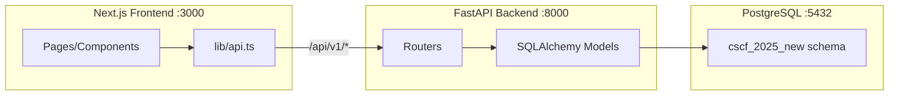

# Full Stack Backend + Frontend Integration

## Current State

- **Frontend:** Next.js 16 app at `frontend/` with mock auth (localStorage-based `AuthContext`), static data in `lib/data/*.ts`, 8 domain pages, role-based routing
- **Backend:** None -- no Python, no API, no database
- **Data Sources:** `SWIFT_Compliance_Platform_PRD_v2.docx` (authoritative schema -- 20 tables, 21 ENUMs), `SWIFT_CSCF_v2025_Canonical_Evidence_Model.xlsx` (53 evidence items, control mappings, sufficiency matrix), `MultiControl_Evidence_Sufficiency.xlsx` (multi-control items, sufficiency detail)
- **DB credentials:** `127.0.0.1:5432`, database `compliance`, user `postgres`, app user `compliance-audit`, password `Compliance_Audit01`, SSL off

---

## Phase 1: Python Script -- Schema + Tables

Create `backend/scripts/create_schema.py` that connects to the PostgreSQL instance and:

1. Creates schema `cscf_2025_new` (`CREATE SCHEMA IF NOT EXISTS cscf_2025_new`)
2. Creates 21 PostgreSQL ENUM types (from PRD Table 29: `architecture_type`, `user_role`, `assessment_phase`, `control_type`, `collection_priority`, `reuse_tier`, `collection_model`, `evidence_status`, `review_level`, `review_status`, `review_decision`, `gate_type`, `gate_status`, `sufficiency_status`, `evaluation_source`, `upload_status`, `report_type`, `compliance_status`, `vendor_classification`, `vendor_access`, `subscription_tier`)
3. Creates all **20 tables** per PRD v2 (Tables 7--11 and inventory Table 5):
  - `tenants` (root entity, BIC code, architecture_type, subscription_tier, settings JSONB)
  - `users` (external auth model, auth_provider_uid, mfa_enabled, per-tenant unique email)
  - `audit_frameworks` (immutable, framework definitions)
  - `controls` (32 CSCF controls, architecture_applicability TEXT[])
  - `evidence_domains` (8 domains A-H)
  - `canonical_evidence_items` (53 items, JSONB input_schema + sufficiency_dimensions)
  - `item_control_mappings` (M:N junction, is_primary, weight, sufficiency_requirement)
  - `cross_domain_dependencies` (cross-domain validation rules)
  - `assessment_cycles` (7-phase lifecycle, snapshot_data, previous_cycle_id)
  - `control_applicability` (per-cycle scoping, override support)
  - `evidence_submissions` (scope_key pattern, form_data JSONB, AI fields)
  - `evidence_attachments` (GCS/local metadata, SHA-256, upload_status pipeline)
  - `vendor_registry` (domain F vendors per cycle)
  - `sufficiency_scores` (per-control per-cycle aggregate)
  - `sufficiency_evaluations` (append-only per-item evaluation log)
  - `review_assignments` (3-level workflow with SLA tracking)
  - `review_comments` (threaded, @mentions, resolution tracking)
  - `approval_gates` (4 sequential gates, MFA for final)
  - `assessment_reports` (JSONB sections, snapshot_data, draft/final)
  - `audit_log` (partitioned by month, BIGSERIAL PK, immutability trigger)
4. Adds a `**cscf_version VARCHAR(10) NOT NULL DEFAULT '2025v'`** column to every table so data is version-tagged and can be updated for future CSCF versions (2026v, etc.)
5. Creates indexes per PRD specifications
6. Creates RLS policies for tenant isolation on the 13 tenant-scoped tables

**Key file:** [backend/scripts/create_schema.py](backend/scripts/create_schema.py)

---

## Phase 2: Seed Reference Data from Excel

Create `backend/scripts/seed_data.py` that reads the two xlsx files and populates:

1. `**audit_frameworks`** -- 1 row for SWIFT CSCF v2025 (id, name, version, metadata JSONB)
2. `**evidence_domains`** -- 8 rows (A-H) from Sheet `1_Canonical_Evidence_Items` domain column + existing frontend `lib/data/domains.ts` for colors
3. `**controls`** -- 32 rows from Sheet `2_Control_Evidence_Matrix` (control_id_code, name, type M/A, principle, architecture_applicability array)
4. `**canonical_evidence_items**` -- 53 rows from Sheet `1_Canonical_Evidence_Items` (item code, name, domain FK, priority, evidence type, description, sufficiency definition, evaluation criteria, input_schema JSONB, sufficiency_dimensions JSONB, collection_model, reuse_tier)
5. `**item_control_mappings**` -- from Sheet `4_Sufficiency_Matrix` / `2_Control_Evidence_Matrix` (evidence_item_id, control_id, is_primary, weight, sufficiency_requirement text)
6. `**cross_domain_dependencies**` -- derived from the evidence model (e.g., E1 depends on A2 inventory)

All seeded rows get `cscf_version = '2025v'`.

**Data sources:**

- `SWIFT_CSCF_v2025_Canonical_Evidence_Model.xlsx` -- Sheets: `1_Canonical_Evidence_Items`, `2_Control_Evidence_Matrix`, `4_Sufficiency_Matrix`
- `MultiControl_Evidence_Sufficiency.xlsx` -- Sheets: `Sufficiency Detail`, `Multi-Control Evidence`

---

## Phase 3: FastAPI Backend

### Directory Structure

```
backend/
  requirements.txt          # fastapi, uvicorn, sqlalchemy, psycopg2-binary, 
                            # python-jose, passlib, python-multipart, openpyxl
  app/
    __init__.py
    main.py                 # FastAPI app, CORS, middleware
    config.py               # Settings from env vars / .env
    database.py             # SQLAlchemy engine, session, Base
    models/                 # SQLAlchemy ORM models (1 file per table group)
      __init__.py
      tenant.py             # Tenant, User
      framework.py          # AuditFramework, Control, EvidenceDomain, 
                            # CanonicalEvidenceItem, ItemControlMapping
      assessment.py         # AssessmentCycle, ControlApplicability, 
                            # EvidenceSubmission, EvidenceAttachment
      review.py             # ReviewAssignment, ReviewComment
      approval.py           # ApprovalGate, AssessmentReport
      vendor.py             # VendorRegistry
      audit.py              # AuditLog
      sufficiency.py        # SufficiencyScore, SufficiencyEvaluation
    schemas/                # Pydantic request/response models
      __init__.py
      auth.py
      tenant.py
      assessment.py
      evidence.py
      review.py
      approval.py
      reference.py
    routers/                # FastAPI APIRouter modules
      __init__.py
      auth.py               # POST /auth/login, /auth/logout, GET /auth/me
      tenants.py            # CRUD /tenants (admin only)
      users.py              # CRUD /users
      assessments.py        # CRUD /assessments, /dashboard, /advance-phase
      controls.py           # GET /assessments/:id/controls, /control-matrix
      evidence.py           # CRUD /assessments/:id/evidence
      files.py              # POST/GET/DELETE /evidence/:subId/files
      sufficiency.py        # POST evaluate, GET evaluations
      reviews.py            # CRUD /assessments/:id/reviews, comments
      approval.py           # GET/POST /assessments/:id/approval
      reports.py            # CRUD /assessments/:id/reports
      vendors.py            # CRUD /assessments/:id/vendors
      reference.py          # GET /ref/frameworks, /domains, /controls, /evidence-items
      audit_log.py          # GET /audit-log
    middleware/
      __init__.py
      auth.py               # JWT validation, extract user/tenant/role
      tenant_scope.py       # Auto-scope queries to tenant
    dependencies.py         # get_db, get_current_user, role_required
  scripts/
    create_schema.py
    seed_data.py
  .env                      # DB credentials (gitignored)
```

### API Routes (aligned to PRD Section 5)

Base: `/api/v1`

- **Auth:** `/auth/login` (JWT), `/auth/logout`, `/auth/me`, `/auth/verify-mfa`
- **Tenants:** `/tenants` (CRUD, admin-only)
- **Users:** `/users` (CRUD, tenant-scoped)
- **Assessments:** `/assessments` (CRUD), `/assessments/{id}/dashboard`, `/assessments/{id}/advance-phase`
- **Controls:** `/assessments/{id}/controls`, `/assessments/{id}/control-matrix`, `/assessments/{id}/sufficiency`
- **Evidence:** `/assessments/{id}/evidence` (CRUD), `/assessments/{id}/evidence/{subId}/submit`
- **Files:** `/evidence/{subId}/files` (upload/download/delete)
- **Sufficiency:** `/evidence/{subId}/evaluate`, `/evidence/{subId}/evaluations`
- **Reviews:** `/assessments/{id}/reviews`, `/reviews/{reviewId}/comments`
- **Approval:** `/assessments/{id}/approval`, `/assessments/{id}/approval/{gateType}/approve`
- **Reports:** `/assessments/{id}/reports` (CRUD), `/{reportId}/finalize`, `/{reportId}/export/{format}`
  - **Vendors:** `/assessments/{id}/vendors` (CRUD)
- **Reference:** `/ref/frameworks`, `/ref/domains`, `/ref/controls`, `/ref/evidence-items`, `/ref/dependencies`
- **Audit:** `/audit-log`

### Auth Strategy

Since this is Phase 1 without Firebase/Auth0, implement simple JWT auth:

- `POST /auth/login` accepts `{email, password}`, returns JWT with claims `{sub, email, role, tenantId}`
- Password hashed with bcrypt in `users.password_hash` (added as temporary column until external auth migration)
- JWT middleware extracts user context for every request
- Role-based route guards via FastAPI `Depends(role_required("admin"))`

---

## Phase 4: Frontend Integration

Replace mock localStorage data/auth with real API calls:

1. **Create API client** -- `frontend/lib/api.ts` with fetch wrapper, base URL, JWT token management
2. **Update `auth-context.tsx`** -- Replace localStorage-based login/signup with `POST /api/v1/auth/login` and `POST /api/v1/auth/signup`. Store JWT token. Fetch user profile on load via `GET /api/v1/auth/me`.
3. **Replace static data imports:**
  - `lib/data/domains.ts` -> `GET /api/v1/ref/domains`
  - `lib/data/controls.ts` -> `GET /api/v1/ref/controls`
  - `lib/data/evidence-items.ts` -> `GET /api/v1/ref/evidence-items`
  - `lib/data/architectures.ts` -> `GET /api/v1/ref/frameworks/{id}` (architecture types from controls table)
4. **Dashboard page** -- Fetch from `GET /api/v1/assessments/{id}/dashboard`
5. **Evidence model page** -- Fetch from `GET /api/v1/assessments/{id}/evidence`
6. **Domain pages** -- Fetch domain items from `GET /api/v1/ref/domains/{id}`
7. **Admin page** -- Wire tenant CRUD to `POST/GET /api/v1/tenants`
8. **Architecture selection** -- Wire to `POST /api/v1/assessments` (creates cycle with architecture)
9. **Review, Approval, Report pages** -- Wire to respective API endpoints
10. **Configure Next.js proxy** -- Add `rewrites` in `next.config.ts` to proxy `/api/v1/`* to FastAPI backend




---

## Version Strategy

Every table includes `cscf_version VARCHAR(10) NOT NULL DEFAULT '2025v'`. When CSCF 2026 is released:

- New reference data rows are inserted with `cscf_version = '2026v'`
- Assessment cycles reference a specific framework version
- Queries filter by version where needed
- Old data remains intact for historical assessments

