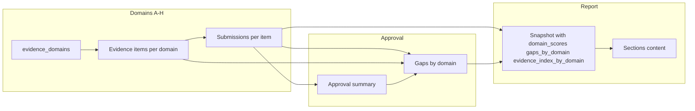

# Domain (A–H) Connection with Approval and Report

This document describes how to connect the eight evidence **Domains (A–H)** to the **Approval** and **Report** flows so the platform communicates effectively end-to-end. It covers ideal data flow, API design, and database changes you run yourself in GCP (no SQL is stored in this repo).

**Reference plan:** [.cursor/plans/approval_and_report_next_step_7070e9ff.plan.md](.cursor/plans/approval_and_report_next_step_7070e9ff.plan.md)

---

## 1. How Domains Connect Today

- **Domains A–H** come from `evidence_domains`; each has `id` (single letter), `name`, `item_count`, `sort_order`.
- **Evidence items** live in `canonical_evidence_items` with `domain_id` (e.g. A, B). Submission `evidence_item_id` (e.g. A1, B2) implies domain via first character.
- **Approval:** `GET .../approval/summary` already returns `domain_breakdown`: per domain, counts of total / approved / submitted / draft. No per-domain gaps or links to evidence yet.
- **Report:** No domain structure; report sections and snapshot do not yet include domain-scoped data.
- **Dashboard:** Returns `domain_scores` (per domain: completed, total, score) and `gaps` (control-level only; control-to-domain is derivable via `item_control_mappings` → `evidence_item_id` → `domain_id`).

---

## 2. Approval: Domain Connection (Ideal Flow)

### 2.1 Goal

- Approver sees **per-domain** evidence and review status (already in `domain_breakdown`).
- Approver sees **gaps grouped by domain** so they know which domain(s) need attention before approving “Gaps documented.”
- Optional: deep link from Approval to **domain evidence** (e.g. “View Domain B evidence”) and from a gap row to the **evidence item(s)** that feed that control.

### 2.2 Data to Expose

| Data | Source | Use on Approval page |
|------|--------|----------------------|
| Domain breakdown | Already in approval summary | Per-domain approved/submitted/draft; link to `/cycles/{id}/domains/{domainId}` |
| Gaps by domain | Derived: dashboard gaps + control → evidence_item_id → domain_id | “Identified gaps” list grouped by domain; “View evidence” per domain |
| Domain list with names | `evidence_domains` (or reference) | Labels and order for breakdown and gap list |

### 2.3 API Suggestions for Approval

**Option 1 – Extend existing summary (recommended)**

- **Endpoint:** `GET /api/v1/assessments/{cycle_id}/approval/summary` (existing).
- **Add to response:**
  - `gaps`: list of `{ control_id, name, score, domain_id }`. Backend derives `domain_id` from control: for each gap control, take evidence items from `item_control_mappings` for that `control_id`, then `domain_id = evidence_item_id[0]` from any mapped item (or from `canonical_evidence_items.domain_id`). If a control maps to items in more than one domain, you can repeat the gap per domain or pick a primary domain.
  - Optional: `gaps_by_domain`: `{ "A": [ gap, ... ], "B": [ ... ], ... }` for direct UI grouping.
  - Optional: `domain_list`: `[ { id, name, sort_order } ]` from `evidence_domains` so the UI does not need a separate reference call.

**Option 2 – Separate gaps endpoint**

- **Endpoint:** `GET /api/v1/assessments/{cycle_id}/approval/gaps`.
- **Response:** `{ gaps: [ { control_id, name, score, domain_id } ], gaps_by_domain: { "A": [...], ... } }`.
- Use when you want to keep summary lightweight and load gaps on demand (e.g. when “Gaps documented” card is expanded).

**Linking to evidence**

- No new API required. Frontend builds links:
  - Domain: `/cycles/{cycleId}/domains/{domainId}` (e.g. A, B, …, H).
  - Evidence item: `/cycles/{cycleId}/domains/{domainId}/items/{itemId}` (itemId from reference or from submission list). If you later add `evidence_item_id` to each gap, link to that item in that domain.

### 2.4 Database Changes for Approval (run in GCP yourself)

- **No new tables required** for the above. Gaps and domain breakdown are derived from:
  - `evidence_submissions` (status, evidence_item_id),
  - `control_applicability` + `sufficiency_scores` (for gap list),
  - `item_control_mappings` + `canonical_evidence_items` (control → domain).
- **Optional (Option B in plan):** If you add explicit **gap actions** (remediation / risk acceptance), add a table, e.g.:
  - **Table name:** e.g. `cycle_gap_actions`.
  - **Columns (conceptual):** `id` (UUID), `cycle_id` (FK to assessment_cycles), `control_id` (or `evidence_item_id`), `action_type` (e.g. `remediation` | `risk_acceptance`), `due_date` (date, nullable), `notes` (text), `acknowledged_by` (FK users, nullable), `created_at`, `updated_at`. Optionally `domain_id` (char(1)) for quick filtering by domain.
  - You run the DDL in your GCP PostgreSQL; no SQL is added to this repo.

---

## 3. Report: Domain Connection (Ideal Flow)

### 3.1 Goal

- Report **snapshot** and **section content** are domain-aware: Control Assessments and Gap Analysis can be grouped by domain; Evidence Index can list evidence by domain (A→H).
- Approver and auditor see the same domain structure in Approval and in the exported Report.

### 3.2 Data to Expose in Snapshot and Sections

| Section | Domain-linked content |
|---------|------------------------|
| Executive Summary | High-level: e.g. “Domain B and D have gaps; others meet threshold.” |
| Scope Statement | List domains in scope (from cycle architecture + evidence_domains). |
| Control Assessments | Group by domain: for each domain, list controls (and scores) that are primarily evidenced by items in that domain (via item_control_mappings). |
| Gap Analysis | List gaps grouped by domain (same derivation as Approval). |
| Evidence Index | List evidence items by domain (A→H), with submission status per item. |

### 3.3 API Suggestions for Report

- **Refresh / generate report:** `POST /api/v1/assessments/{cycle_id}/reports/{report_id}/refresh` (or `generate`).
  - Builds `snapshot_data` including:
    - `domains`: list of `{ id, name, sort_order }` from `evidence_domains`.
    - `domain_scores`: same shape as dashboard (id, completed, total, score) for the cycle.
    - `control_scores_by_domain`: e.g. `{ "A": [ { control_id, name, type, score } ], ... }` (control → domain from item_control_mappings + canonical_evidence_items).
    - `gaps_by_domain`: same as Approval (list of gaps per domain).
    - `evidence_index_by_domain`: e.g. `{ "A": [ { evidence_item_id, name, status } ], ... }`.
  - Fills each report section’s `content` from this snapshot (e.g. Control Assessments = table per domain; Gap Analysis = list per domain; Evidence Index = list per domain).
- **GET report:** Existing `GET .../reports/{report_id}` returns report with `sections[].content` and `snapshot_data`; frontend renders section content and can use `snapshot_data` for export or filters.
- **Export:** `GET /api/v1/assessments/{cycle_id}/reports/{report_id}/export?format=pdf|word|xml`. Backend uses stored `sections` and optionally `snapshot_data` to produce the file; domain grouping can be applied in the export template.

### 3.4 Database Changes for Report (run in GCP yourself)

- **Existing:** `assessment_reports` already has `sections` (JSONB) and `snapshot_data` (JSONB). No schema change required to store domain-scoped snapshot or section content.
- **Suggested structure for `snapshot_data` (application-level, not DDL):**
  - `architecture_type`, `cycle_label`, `generated_at`
  - `domains`: array of `{ id, name, sort_order }`
  - `domain_scores`: array of `{ id, name, completed, total, score }`
  - `control_scores_by_domain`: object keyed by domain id, value array of control score objects
  - `gaps_by_domain`: object keyed by domain id, value array of gap objects
  - `evidence_index_by_domain`: object keyed by domain id, value array of evidence item + status
- **Section content:** Each element in `sections` has at least `name`, `status`, `ai`, and `content` (string). You may add `content_by_domain` later if you want to store domain-specific blobs; for v1, a single `content` per section that includes domain-grouped text is enough.

No new tables or columns are required for the report–domain connection; only backend logic and possibly new columns if you add them (e.g. `updated_at` on reports if not present). Run any DDL you need (e.g. new indexes) in GCP yourself.

---

## 4. End-to-End Flow (Domain ↔ Approval ↔ Report)

- **Evidence** is collected per domain (existing). Approval summary already aggregates by domain (`domain_breakdown`).
- **Gaps** are computed from controls; control → domain is derived via evidence items. Same list (optionally grouped by domain) is used in Approval and in Report snapshot/sections.
- **Report** snapshot is built from the same cycle data (submissions, control applicability, sufficiency, domains); section content is generated from snapshot so Approval and Report stay aligned.

---

## 5. Summary: What to Implement

| Area | Change | Where |
|------|--------|--------|
| Approval | Add `gaps` (and optionally `gaps_by_domain`, `domain_list`) to approval summary response; derive domain per gap from control → item_control_mappings → evidence_item domain. | Backend: [approval.py](backend/app/routers/approval.py) |
| Approval | Frontend: show gap list (grouped by domain), link each row to domain and optionally to evidence item. | Frontend: [approval/page.tsx](frontend/app/(main)/cycles/[cycleId]/approval/page.tsx) |
| Report | Add refresh/generate endpoint; build snapshot with `domains`, `domain_scores`, `control_scores_by_domain`, `gaps_by_domain`, `evidence_index_by_domain`; fill section `content` from snapshot. | Backend: [reports.py](backend/app/routers/reports.py) + small snapshot builder (reuse dashboard/approval logic) |
| Report | Frontend: call refresh, render section content; optional domain filter/tabs in Control Assessments and Gap Analysis. | Frontend: [report/page.tsx](frontend/app/(main)/cycles/[cycleId]/report/page.tsx) |
| DB (GCP) | None required for domain connection. Optional: `cycle_gap_actions` table if you adopt Option B (explicit gap actions); run DDL yourself in GCP. | You run in GCP |

---

## 6. Database Changes to Run in GCP (No SQL in Repo)

You run these in your GCP PostgreSQL instance; do not add SQL files to this repo.

**Optional – Gap actions (Option B from plan)**

- **Table:** `cycle_gap_actions` (or equivalent).
- **Columns:** `id` UUID PRIMARY KEY DEFAULT gen_random_uuid(), `cycle_id` UUID NOT NULL REFERENCES assessment_cycles(id) ON DELETE CASCADE, `control_id` VARCHAR(10) NOT NULL REFERENCES controls(id), `action_type` VARCHAR(20) NOT NULL CHECK (action_type IN ('remediation','risk_acceptance')), `due_date` DATE, `notes` TEXT, `acknowledged_by` UUID REFERENCES users(id), `created_at` TIMESTAMPTZ NOT NULL DEFAULT now(), `updated_at` TIMESTAMPTZ NOT NULL DEFAULT now(). Optional: `domain_id` CHAR(1) REFERENCES evidence_domains(id) for faster filtering.
- **Indexes:** (cycle_id), (cycle_id, control_id) if you enforce one action per control per cycle.

**Existing tables**

- Ensure `assessment_reports.snapshot_data` and `assessment_reports.sections` exist and are JSONB (they already are in your schema). No change needed for domain-linked snapshot content.
- No change to `evidence_domains`, `canonical_evidence_items`, or `item_control_mappings` for this design.

This keeps the domain–approval–report connection clear, enables the right APIs without storing SQL in the repo, and leaves all DDL execution to you in GCP.
