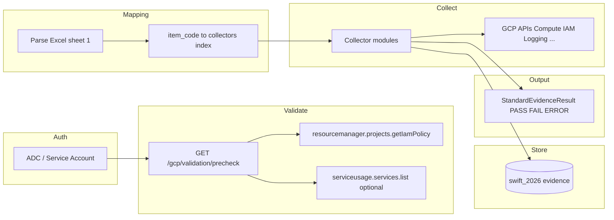

# GCP API-driven evidence collection — architecture (SWIFT CSCF v2026)

## Source of truth

- **Workbook**: `GCP_Evidence_CollectionforSWIFT_v2026_Updated.xlsx`  
  - Sheet `1_Evidence_GCP_Mapping`: SWIFT domain, evidence item, GCP services, **API / data source** text, automation feasibility.
- **Runtime config**: `GCP_EVIDENCE_PROJECT_ID`, optional `GCP_EVIDENCE_WORKBOOK_PATH`, **Application Default Credentials** (workload identity, SA key, or `gcloud auth application-default login`).

## End-to-end flow



1. **Authenticate** — ADC provides tokens; no end-user OAuth in the current backend path.
2. **Validate** — `GET /api/v1/gcp/validation/precheck` verifies IAM read and optionally lists enabled services.
3. **Map** — `GET /api/v1/gcp/workbook/mapping` returns parsed rows from the Excel file on the server.
4. **Collect** — `POST /api/v1/gcp/runs/collect` persists control-level rows as today; **`POST /api/v1/gcp/runs/collect-structured`** runs the same collectors and returns **`StandardEvidenceResult`** per workbook evidence item (`evidence_id`, `status`, `data`, `errors`).
5. **Normalize** — Each collector returns payloads passed through `sanitize_for_jsonb` before DB and HTTP.
6. **Errors** — Google exceptions are classified in `gcp_evidence/platform/gcp_errors.py` (`PERMISSION_DENIED`, `API_NOT_ENABLED`, etc.). HTTP routes map DB deadlocks on evidence list to **503** with a retry message (no raw 500 for that case).

## Module layout

| Layer | Path | Role |
|--------|------|------|
| Workbook | `gcp_evidence/workbook/excel_spec.py` | Load Excel → `WorkbookEvidenceRow` |
| Index | `gcp_evidence/workbook/collector_index.py` | SWIFT item code → collector ids |
| Schema | `gcp_evidence/schemas/standard_evidence.py` | `StandardEvidenceResult` |
| Errors | `gcp_evidence/platform/gcp_errors.py` | Exception → code + message |
| Retry | `gcp_evidence/platform/retry_policy.py` | Shared `google.api_core.retry` preset |
| Precheck | `gcp_evidence/services/precheck.py` | IAM + Service Usage checks |
| Orchestration | `gcp_evidence/services/collector_service.py` | Persist collect + structured assembly |
| Collectors | `gcp_evidence/collectors/*.py` | Per-domain API calls |

## API mapping (workbook → implemented collectors)

The Excel lists **many** APIs (incl. SCC `securitycenter.*`, org-wide Asset, Policy). **Implemented in code** today follow `SWIFT_2026_GCP_COLLECTOR_PLAN.md` and `collectors/__init__.py`. Items without a registered collector appear in **`collect-structured`** as **`FAIL`** with an explanation (manual / future SCC / Workspace / etc.).

**Planned extensions** (from sheet): Security Command Center findings API, Org Policy constraints (Org API), Cloud Storage bucket IAM metadata, Policy Analyzer, binary authorization — add new collector modules and register them in `COLLECTORS` with `CONTROL_MAPPINGS`.

## Standard result shape

```json
{
  "evidence_id": "A1",
  "status": "PASS",
  "data": { "network_topology": { } },
  "errors": []
}
```

- **`PASS`** — All collectors mapped to that item succeeded and returned payload.
- **`ERROR`** — At least one collector failed (partial data may appear under `data`).
- **`FAIL`** — No automated collector registered for that item in this release.

## Operations

- Enable required **VPC APIs** (Compute, IAM, Logging, …) per `gcp_evidence/README.md`.
- Grant least-privilege **viewer** roles; expand when `PERMISSION_DENIED` appears in collector errors or precheck.
